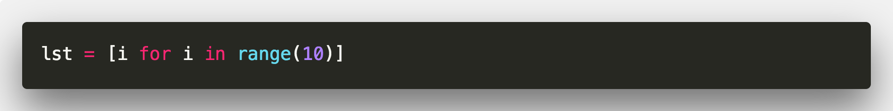
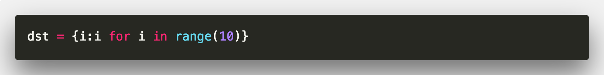
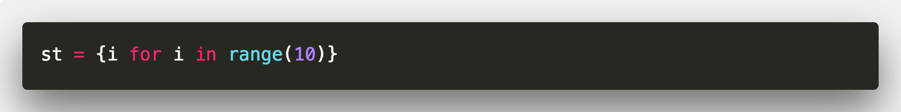

# 推导式

`推导式分类`

- 列表(list)推导式
- 字典(dict)推导式
- 集合(set)推导式

## 列表推导式

```python
# 简单示例
lst = [i for i in range(10)]
```



## 字典推导式

```python
dst = {i:i for i in range(10)}
```


## 集合推导式

```python
st = {i for i in range(10)}
```

