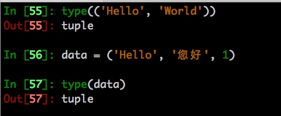
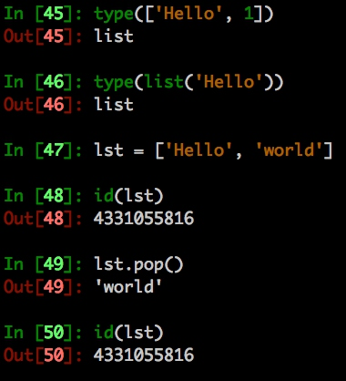

# Python基础数据结构

## 内置类型

> Python里的所有数据 (布尔值、整数、浮点数、字符串，甚至大型数据结构、函数等都是以对象的形式存在的)
> Python中一切皆对象

## Python3 中内置类型

- bool
- int
- float
- complex
- str
- list, tuple
- dict
- set, fronzenset

## 布尔值 bool

> None、0、空字符串、以及没有元素的容器都为 False, 反之为True

## 数字 int
整型，如 -1, 0, 3 等

## 浮点数 float
浮点型, 如 0.1, 3.14 等

## 字符串 str

> 字符串是不可变类型，是由字符组成的序列

## 列表 list

`一种可变的容器类型`

> 在Python的官方实现中，list是一种采用分离式技术实现的动态顺序表

## 元组 tuple

> 元组是跟列表非常接近的容器类型
> 但与列表一个很重要的区别是元组是一种不可变类型

## 字典 dict

> Python中字典的CPython实现是 hash map

## 集合 set

> set可以理解为只有key的字典

## fronzenset

> set的只读版本


Python中三类主要的数据结构(序列、映射、集合)

## 序列
- 列表
- 元组
- 字符串

## 映射
- 字典

## 集合
- set


## tuple 元组

> 元祖以小括号包裹数据

- `(只有一个数据时记得加个逗号，否则它将变成其他类型的数据而不是元组)`
- 元组可以存不同类型的数据
- 元组为不可变对象




## list 列表
> 列表以中括号包裹数据，或者使用list
> Python中的列表实际上是一个变长的数组

[Python列表对象实现原理](https://foofish.net/python-list-implements.html)

- 列表为可变对象




## dict 字典
> 字典以大括号或dict包裹
> Python的字典是用哈希表(hash table)实现的。
> 哈希表是一个数组，它的索引是对键运用哈希函数(hash function) 求得。


`判断某个key是否在字典中`

```python
data = {'hello': 'world'}
key = 'hello'
key in data
```


## set 集合

> set是一组key的集合, 没有重复的元素

### 基本操作

- add 添加元素
```python
data = {1, 2, 3}
data.add(4)
```

- 并集
```python
{1, 2} | {3}
```

- 交集
```python
{1, 2} & {1, 3}
```
