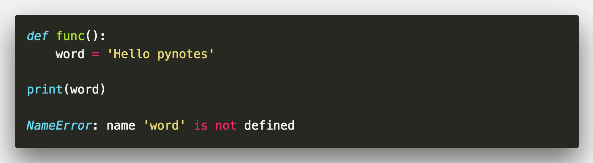
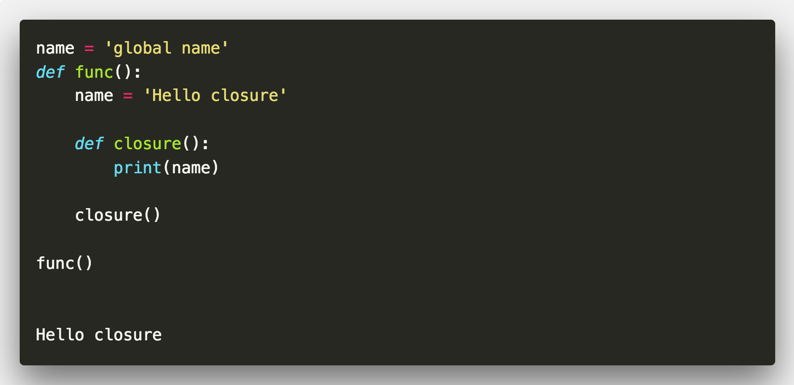
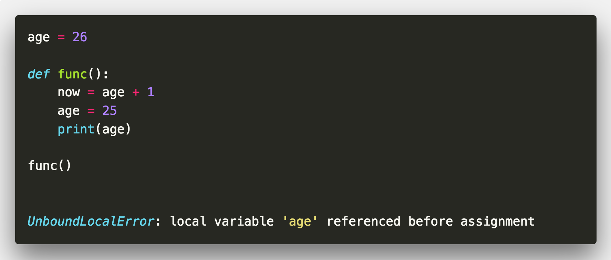

# 变量作用域与LEGB

> Python的名字空间一个非常核心的内容;
> 其实Python的变量名是一个字符串对象，它所指向的对象才是变量本身;
> 这些(变量名) 名字与所指向的对象构成键值对，名字空间中有很多键值对;
> 而LEGB则是名字空间对查找规则

## LEGB

> LEGB 是4个作用域对简称 分别是:

- Local: 函数内的名字空间
- Enclosing function locals: 外部嵌套函数的名字空间 (如closure)
- Global: 函数所在模块的名字空间(文件)
- Builtin: Python内置模块的名字空间

`Python变量的查找顺序`

```
local -> enclosing -> global -> builtin
```


## 局部变量

```python
def func():
    word = 'Hello pynotes'

print(word)
```



> 上面的代码会报 NameError 错误
>  因为 变量word只在 func函数中定义，直接 在外部print python找不到这个变量


## 闭包函数
```python
name = 'global name'
def func():
    name = 'Hello closure'

    def closure():
        print(name)

   closure()

func()
```



## 全局变量

```python
name = 'silence'

def func():
    print(name)

func()
```


>  func函数中找不到name变量时就往再上一级查找


## 一些问题


```python
age = 26

def func():
    now = age + 1
    age = 25
    print(age)

func()
```



>  你可能会以为 会输出 25，结果报了UnboundLocalError错误


