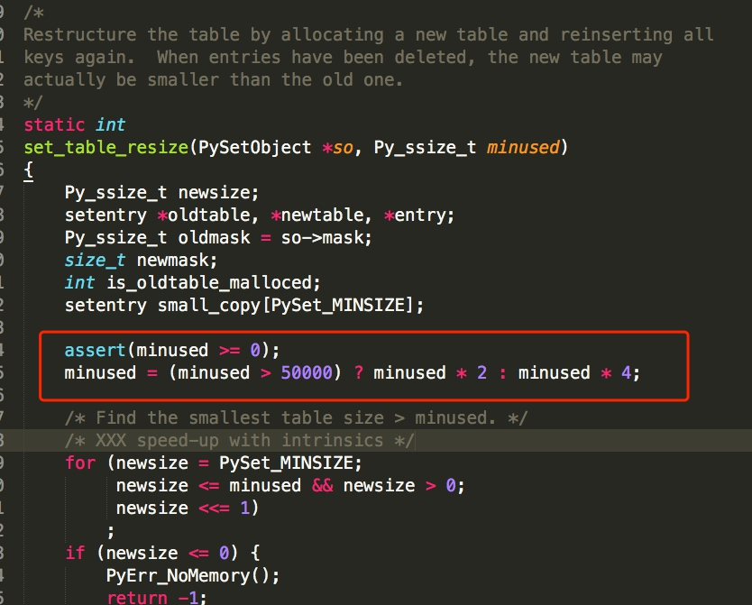

# 内置类型

## Python3 中内置类型

- bool
- int
- float
- complex
- str
- list, tuple
- dict
- set, fronzenset

## 布尔值 bool

> None、0、空字符串、以及没有元素的容器都为 False, 反之为True

## 数字 int

## 字符串 str
> 字符串是不可变类型

## 列表 list

`一种可变的容器类型`

> 在Python的官方实现中，list是一种采用分离式技术实现的动态顺序表
> 在Python的官方系统中，list实现采用如下的实际策略:

- 在建立空表（或很小的表）时，系统分配一块能容纳8个元素的存储区；
- 在执行插入操作(insert或append等)时，如果元素区满就换一块4倍大的存储区。
- 但如果当时的表已经很大，系统将改变策略，换存储区时容量加倍
- 这里的“很大”是一个实现确定的参数，目前值是50000 (为了避免出现过多空闲的存储位置)
- 通过这套技术实现的list，尾端加入元素操作的平均时间复杂度是O(1)

## 元组 tuple

> 元组是跟列表非常接近的容器类型
> 但与列表一个很重要的区别是元组是一种不可变类型
