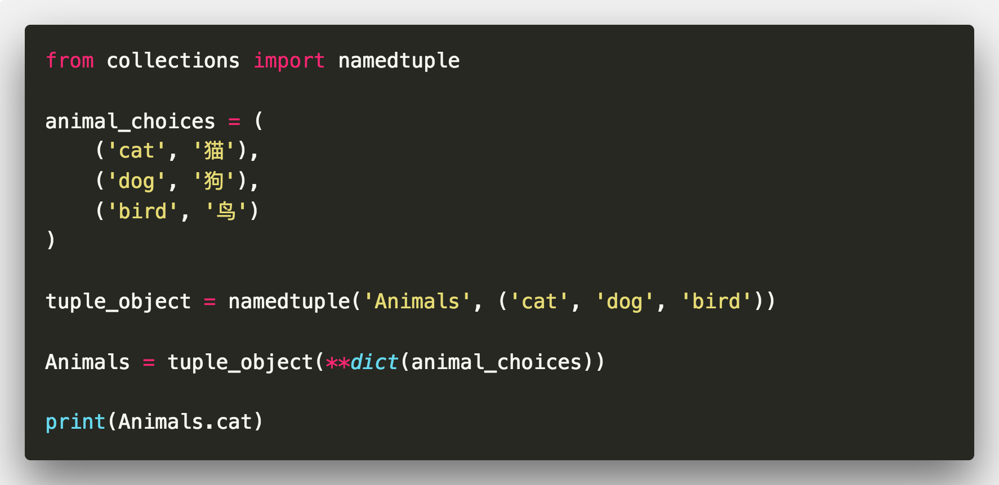

# collections

## collections.namedtuple

>  创建可以用名字访问元素的对象，且新生成的对象具备tuple的不变性

```python
from collections import namedtuple

animal_choices = (
    ('cat', '猫'),
    ('dog', '狗'),
    ('bird', '鸟')
)

tuple_object = namedtuple('Animals', ('cat', 'dog', 'bird'))

Animals = tuple_object(**dict(animal_choices))

print(Animals.cat)
```



## collections.deque

```python
from collections import deque

que = deque(['Hello', 'world'])
que.append('你好')
que.appendleft('世界')
print(que)
```


## collections.defaultdict

```python
from collections import defaultdict
dst = defaultdict(lambda: 'default value')

print(dst['hello'])
```

## collections.ChainMap

```python
from collections import ChainMap

dst1 = {'hello': 'world'}
dst2 = {'你好': '世界'}

dst = ChainMap(dst1, dst2)
print(dst)
```
