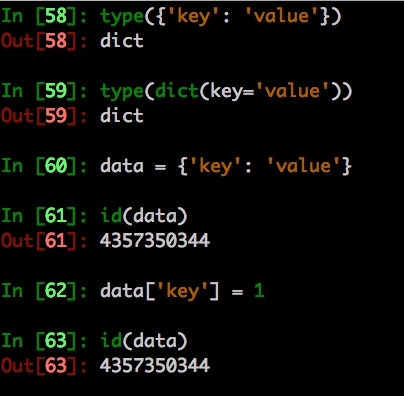

# 字典 dict

## 描述

- 字典以大括号或dict包裹
- Python的字典是用哈希表(hash table)实现的。
- 使用开放地址法处理冲突
- 哈希表是一个数组，它的索引是对键运用哈希函数(hash function) 求得。

`dict的key必须是不可变对象` 即可hash的

## 示例



`判断某个key是否在字典中`

```python
data = {'hello': 'world'}
key = 'hello'
key in data
```
