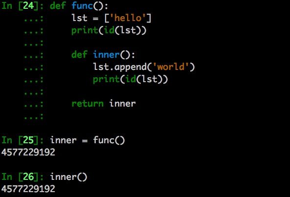

# 闭包

> 在计算机科学中，闭包（英语：Closure），又称词法闭包（Lexical Closure）或函数闭包（function closures），是引用了自由变量的函数。这个被引用的自由变量将和这个函数一同存在，即使已经离开了创造它的环境也不例外。所以，有另一种说法认为闭包是由函数和与其相关的引用环境组合而成的实体。闭包在运行时可以有多个实例，不同的引用环境和相同的函数组合可以产生不同的实例


## 示例

```python
def func():
    lst = ['hello']
    print(id(lst))

    def inner():
        lst.append('world')
        print(id(lst))

    return inner
```



