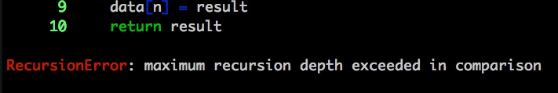
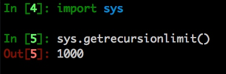

# 递归

> 在数学与计算机科学中，是指在函数的定义中使用函数自身的方法   - 维基百科

`斐波那契是个很好的展示递归的例子`

```python
def fib(n):
    if n < 2:
        return 1
    return fib(n - 1) + fib(n - 2)
```

## 递归优化

```python
data = {}
def fib(n):
    if n in data:
        return data[n]
    if n < 2:
        result = 1
    else:
        result = fib(n - 1) + fib(n - 2)
    data[n] = result
    return result
```

`但是当n达到一定数量时，会出现以下错误`


> 这是因为函数的递归使用的栈，函数调用时入栈，返回时推栈。栈的大小有限制，在Python中这个值默认是1000




当然你可以通过`sys.setrecursionlimit` 函数改变这个值，但是不推荐这么做

那有什么办法避免这个错误呢？

有一种办法就是改为循环

```python
def fib(n):
    data = {1:1, 2:1}
    if n > 2:
        for i in range(3, n + 1):
            data[i] = data[i - 1] + data[i - 2]
    return data[n]
```

## 那还要递归干嘛用呢？
> 因为递归能在一些场景种有更清晰的代码结构，而循环不能

例如:
- 数据的定义是按递归定义的   Fibonacci函数
- 问题解法按递归算法实现   如: 汉诺塔问题
- 数据的结构形式是按递归定义的  如二叉树、广义表等

## 非常遗憾Python没有对尾递归做优化
