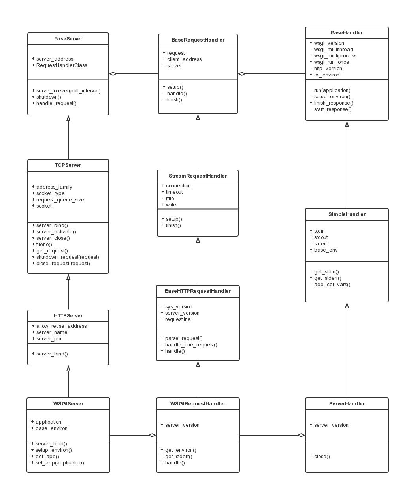

# wsgiref

http://cizixs.com/2014/11/09/dive-into-wsgiref



`示例`

```python
from wsgiref.simple_server import make_server

def wsgi_handler(environ, start_response):
    status = '200 OK'
    headers = [('Content-type', 'text/plain')]
    start_response(status, headers)

    return ['Hello wsgiref']

httpd = make_server('', 8000, wsgi_handler)
print("Serving on port 8000...")

httpd.serve_forever()
```
