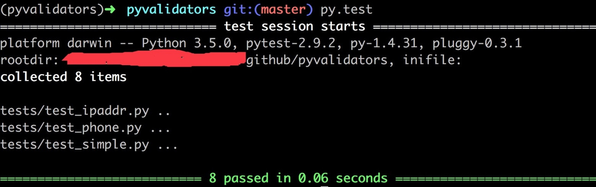

# 程序打包

https://tommao.me/python/publish-python-package


> disutils从1998年便已经是python标准库的一部分。它最早由Greg Ward开发。
在2000年开发停止，从那以后，一些开发人员开始在其基础上继续开发他们自己的工具。其中
最成功的继任者便是打包库setuptools


## 使用setuptools打包python库

`setup.py`代码示例

```python
# -*- coding: utf-8 -*-
from setuptools import setup, find_packages
setup(
    name='yourapp',
    version='0.1',
    description='description.',
    author='author',
    author_email='author@gmail.com',
    install_requires=[],
    packages=find_packages(),
    include_package_data=True,
    zip_safe=False,
    url='https://github.com/author/yourapp',
    keywords='keyword!'
)
```

## 发布你的项目

- 先到 pypi 上注册账号如果你还没注册的话。
- 打开你的 ~/.pypirc 文件

```python
[disutils]
index-servers = pypi

[pypi]
username = <your usernmae>
password = <your password>
```

- python setup.py register
- python setup.py sdist upload

文件结构可以参考我的一个项目

https://github.com/istommao/pyvalidators

## 测试

> 一个好的python库少不了测试

关于测试也有一些选择，比如nose，pytest或者是自带的unittesst。

这个库我选择的是pytest





看着绿色的通过码得飞起。

测试的好处就是当你要调整代码时可以帮你检查到可能出现的错误，提高代码质量。
