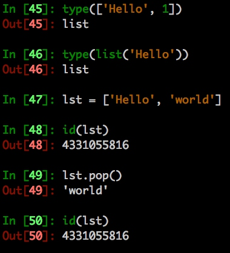

# Python基础数据结构

Python中三类主要的数据结构(序列、映射、集合)

## 序列
- 列表
- 元组
- 字符串

## 映射
- 字典

## 集合
- set


## tuple 元组

> 元祖以小括号包裹数据

- `(只有一个数据时记得加个逗号，否则它将变成其他类型的数据而不是元组)`
- 元组可以存不同类型的数据
- 元组为不可变对象


## list 列表
> 列表以中括号包裹数据，或者使用list
> Python中的列表实际上是一个变长的数组

[Python列表对象实现原理](https://foofish.net/python-list-implements.html)

- 列表为可变对象(增改数据不改变内存地址)




## dict 字典
> 字典以大括号或dict包裹

`字典的实现`
> Python的字典是用哈希表(hash table)实现的。
> 哈希表是一个数组，它的索引是对键运用哈希函数(hash function) 求得。


`判断某个key是否在字典中`

```python
data = {'hello': 'world'}
key = 'hello'
key in data
```


## set 集合

> set是一组key的集合, 没有重复的元素

### 基本操作

- add 添加元素
```python
data = {1, 2, 3}
data.add(4)
```

- 并集
```python
{1, 2} | {3}
```

- 交集
```python
{1, 2} & {1, 3}
```

