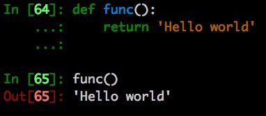
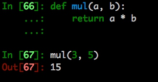

# 函数编程
> Python函数以def关键字定义

```python
def func():
    return 'Hello world'
```



## 一个简单的计算
```python
def mul(a, b):
    return a * b

mul(3, 5)
```




## 递归
> 在数学与计算机科学中，是指在函数的定义中使用函数自身的方法   - 维基百科

`斐波那契是个很好的展示递归的例子`

```python
def fib(n):
    if n < 2:
        return 1
    return fib(n - 1) + fib(n - 2)
```

[更多递归内容请看](functional/recursion.md)
